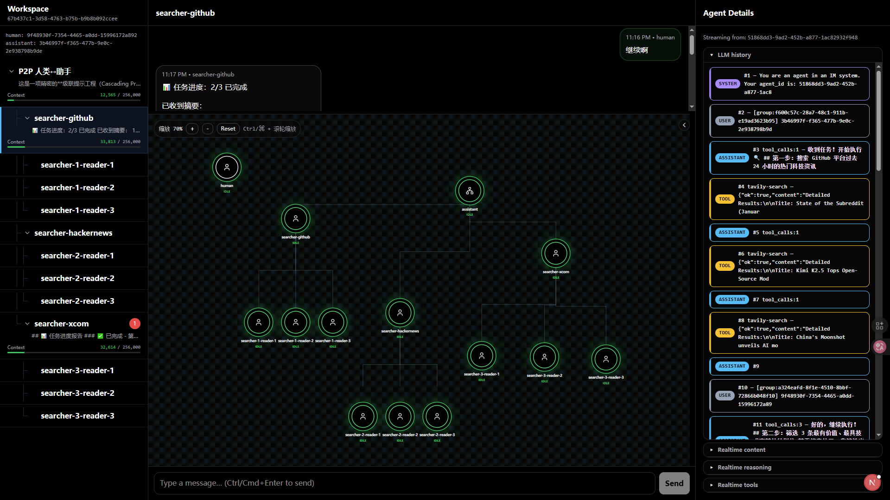

# 为 Multi-Agent 设计的蜂群系统



视频【开源版 Kimi-K2.5 蜂群多 Agent】  
https://www.bilibili.com/video/BV1X163BQE5c/?share_source=copy_web&vd_source=e0705640ea2f51669a392fb07684e286

## 优势
- 任意动态创建 sub-agent
- 可以向任意 agent 发送消息
- 微信式聊天界面，随时介入任何子代理
- 流式 graph 动态展现协作状态

## 哲学
- 极简原语：系统只依赖少量通信原语即可表达多 Agent 行为（核心是 create + send，复杂协作由此组合而来）。
- 液态拓扑：拓扑不预设、在运行中自演化；遇到复杂任务时由 Agent 主动“雇佣”下属。
- 扁平协作：人类可以像聊天一样介入任意层级，使复杂拓扑可观察、可调试、可介入。

## 运行方式
```
cd agent-wechat
cd backend

docker compose up -d
curl -X POST http://127.0.0.1:3017/api/admin/init-db
bun install
bun dev
```

访问 http://localhost:3017

点击 init-db ，然后创建 workspace 即可开始对话。

对话中，你可以询问他都有哪些能力，然后用自然语言就能让它开始运作
